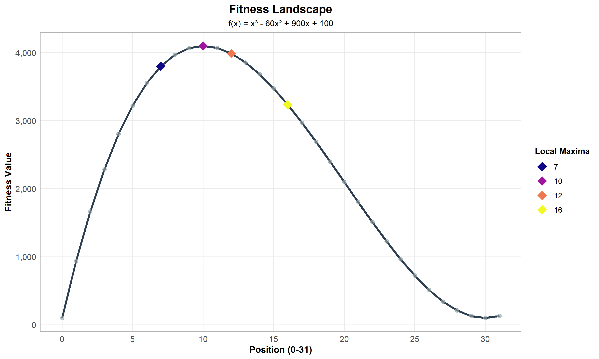
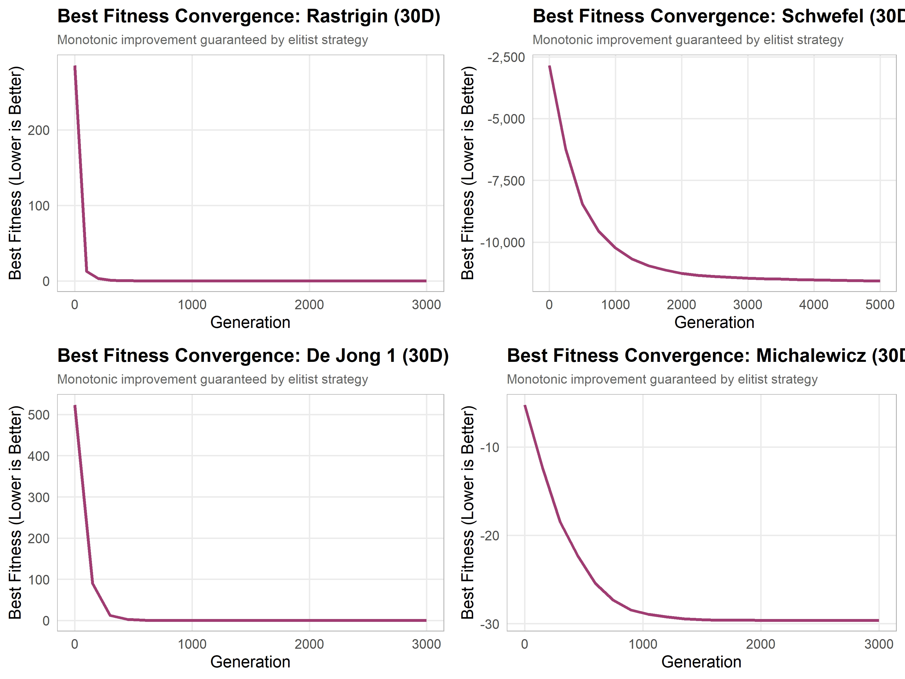
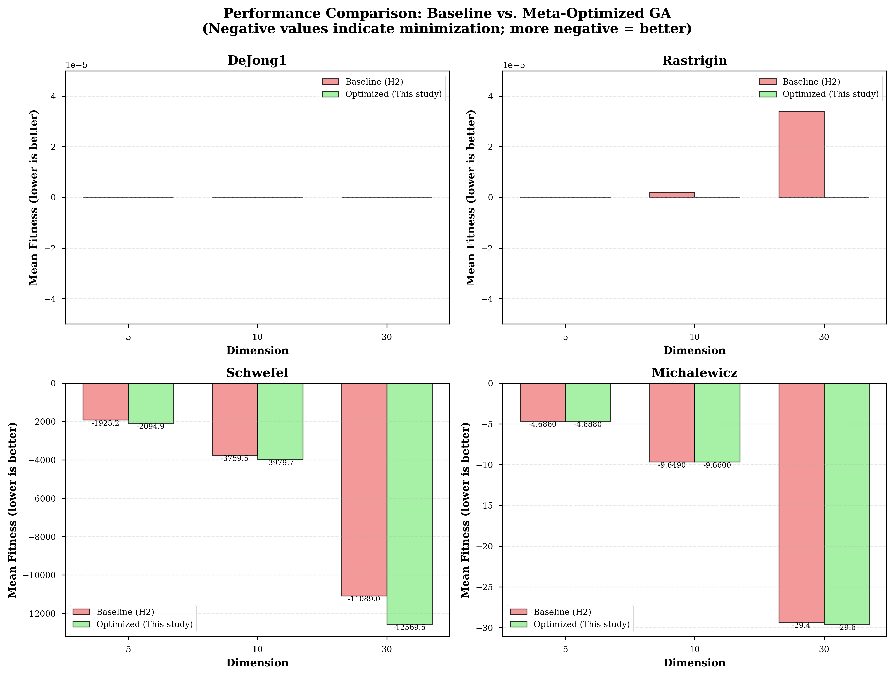
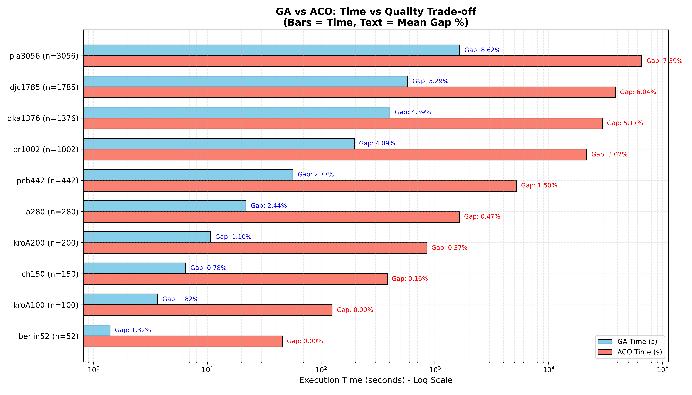

# Genetic Algorithms Coursework Portfolio

A curated, end-to-end journey through local search, real-coded genetic algorithms, meta-optimization, and large‑scale combinatorial optimization.  
Each folder is a standalone milestone, with code, data, visualizations, and a written scientific report.

---

## Roadmap — Evolution of the Subject

| Stage | Directory | Focus | Core Deliverables | Signature Outcome |
| --- | --- | --- | --- | --- |
| **H1p** | `[GA]_Negura_TeodorAlexandru_2E1_H1p` | Fitness‑landscape analysis for Hill Climbing | C++ implementation, CSV trajectories, R visualizations, paper | Best‑Improvement succeeds **~87%** vs First‑Improvement **~44%** |
| **H2** | `[GA]_Negura_TeodorAlexandru_2E1_H2` | Real‑coded GA for continuous benchmarks | GA source, convergence data, graphs, report | GA reaches near‑optimal precision in 30D |
| **H2p** | `[GA]_Negura_TeodorAlexandru_2E1_H2p` | Meta‑GA parameter tuning | Meta‑optimization code, optimized params, report | Up to **~13%** improvement on Schwefel |
| **H3** | `[GA]_Negura_TeodorAlexandru_2E1_H3` | TSP: GA vs ACO (hybridized) | GA/ACO implementations, TSPLIB data, results, full paper | Near‑optimal tours under strict 2000‑iteration / 200‑population limits |

---

## Repository Map

- **`[GA]_Negura_TeodorAlexandru_2E1_H1p/`**  
  - `main.cpp`, `main_viz.cpp`, `header*.h` — Hill Climbing experiments  
  - `visualizations.R` — plots for basins, trajectories, success rates  
  - `*.csv`, `*.png` — landscapes and trajectories

- **`[GA]_Negura_TeodorAlexandru_2E1_H2/`**  
  - `source_code/` — real‑coded GA for DeJong1, Rastrigin, Schwefel, Michalewicz  
  - `convergence_data/` — per‑function convergence traces  
  - `graphs_output/` — performance grids

- **`[GA]_Negura_TeodorAlexandru_2E1_H2p/`**  
  - `source_code/` — meta‑GA for hyperparameter search  
  - `Results/optimized_params/` — best parameters per function & dimension  
  - `Graphs/` — parameter adaptation and comparison plots

- **`[GA]_Negura_TeodorAlexandru_2E1_H3/`**  
  - `src/GA`, `src/ACO` — high‑performance GA and ACO TSP solvers  
  - `data/tsplib/` + `data/optimal_solutions.txt` — benchmark instances & optima  
  - `results/` — GA/ACO statistics across 10 TSPLIB instances  
  - `Raport/` — full scientific paper + figures

---

## Scientific Papers & Reports (Highlights)

### 1) Fitness Landscape Analysis for Hill Climbing
- **Paper:** `./[GA]_Negura_TeodorAlexandru_2E1_H1p/LaTeX/1ffec5355a0640f486a4d9fce35fafec.pdf`  
- **Core insight:** Algorithm strategy reshapes perceived landscape difficulty. Best‑Improvement yields a dominant attraction basin, while First‑Improvement fragments the search space into competing basins.

### 2) Efficient Minimization of Continuous Functions Using Real‑Coded GAs
- **Paper:** `./[GA]_Negura_TeodorAlexandru_2E1_H2/presentation/Prezentare.pdf`  
- **Core insight:** Real‑coded GA outperforms hill climbing and simulated annealing on multimodal, high‑dimensional benchmarks and reaches machine precision on easier landscapes.

### 3) Meta‑Optimization of a Real‑Coded GA
- **Paper:** `./[GA]_Negura_TeodorAlexandru_2E1_H2p/Presentation/H2'.pdf`  
- **Core insight:** Meta‑GA tuning yields measurable improvements on harder functions (Schwefel, Michalewicz), while easy landscapes are already saturated.

### 4) TSP Optimization: GA vs ACO
- **Paper:** `./[GA]_Negura_TeodorAlexandru_2E1_H3/Raport/H3_TSP_GA_ACO_report.pdf`  
- **Core insight:** Both algorithms achieve near‑optimal tours under strict budgets via aggressive elitism, diversity preservation, and hybrid local search (2‑opt & Lin–Kernighan).

---

## Key Results at a Glance

- **H1p:** Best‑Improvement Hill Climbing reaches the global optimum in **28/32** starts vs **14/32** for First‑Improvement.  
- **H2:** GA achieves near‑zero error on DeJong1 and Rastrigin (30D), and strongly improves over SA on Schwefel and Michalewicz.  
- **H2p:** Meta‑GA improves Schwefel performance by **~13.35%** (30D) and reduces variance on difficult landscapes.  
- **H3:** GA and ACO produce strong results across 10 TSPLIB instances, with ACO matching known optima on small instances and GA maintaining competitive gaps on large ones.

---

## Visual Gallery

| H1p — Landscape | H2 — GA Performance | H2p — Meta‑GA Comparison | H3 — GA vs ACO |
| --- | --- | --- | --- |
|  |  |  |  |

---

## Benchmarks & Data

- **Continuous optimization:** DeJong1, Rastrigin, Schwefel, Michalewicz  
- **Combinatorial optimization:** TSPLIB symmetric TSP instances  
- **Results:** CSV and TXT summaries stored under each assignment’s `results/` or `convergence_data/` folders.

---

## How to Navigate / Reproduce

There is **no single build script** for the entire repository. Each assignment provides its own C++ entry points:

- **H1p:** `main.cpp`, `main_viz.cpp`  
- **H2:** `source_code/main.cpp`  
- **H2p:** `source_code/meta_optimization.cpp`, `source_code/compare_results.cpp`  
- **H3:** `src/GA/run_experiment.cpp`, `src/ACO/aco_experiment*.cpp`

Compile the relevant file(s) with a C++ compiler (e.g., `g++`) and run in the corresponding folder, then inspect generated CSV/plot outputs.

---

## Assignment Brief (H3)

The original assignment constraints and reporting template are preserved in:  
`./[GA]_Negura_TeodorAlexandru_2E1_H3/Docs/Requirment`
